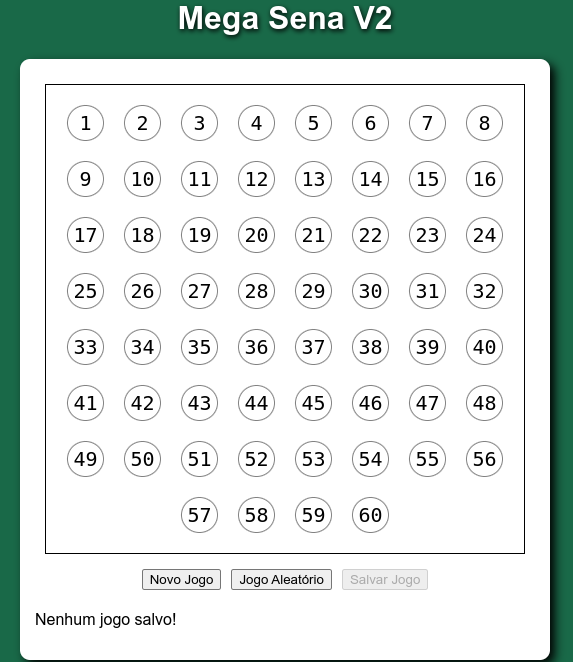
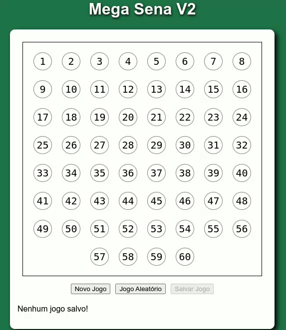
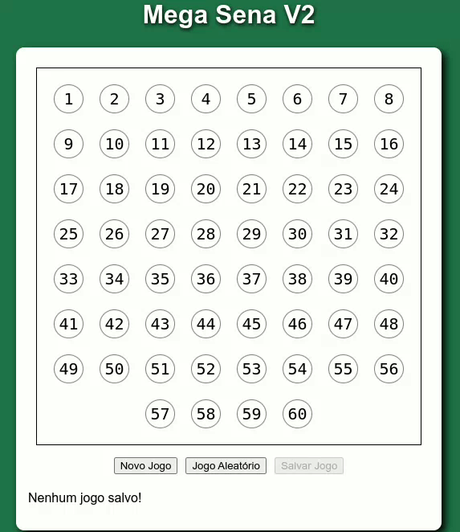
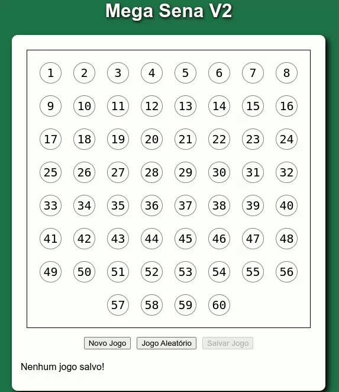
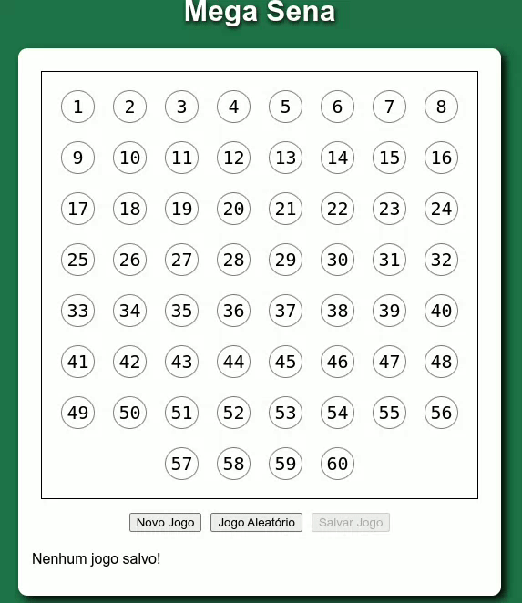

# Simulador de jogos da Mega Sena
> Aplicativo web capaz de salvar jogos de 6 números da Mega Sena, gerar jogos automáticos e salvar "in memoria".

Link para o app no netlify: https://tiny-cendol-a7e21c.netlify.app/

## Imagens do aplicativo:

Tela Inicial

É possível selecionar e retirar a seleção do número ao clicar nele. O número selecionado recebe um destaque na cor verde.

O aplicativo permite que sejam feits jogos aleatórios ao clicar no botão. A cada clique, um novo jogo é criado.

O botão "Novo jogo" zera o tabuleiro para que possa ser feito um novo jogo.

O aplicativo é capaz de salvar os jogos na memória através do próprio navegador. Os números salvos são exibidos na parte de baixo do aplicativo.

